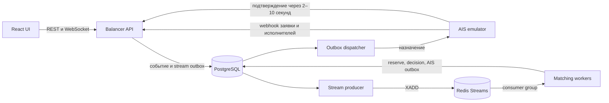
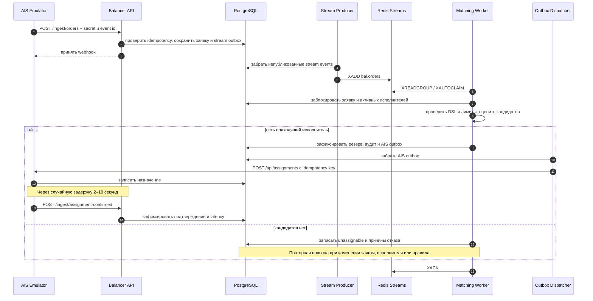

# Архитектура Executor Balancer

Сервис построен как модульный backend с несколькими независимыми процессами. PostgreSQL хранит состояние и transactional outbox, Redis Streams передаёт события worker-группе, API-эмулятор показывает интеграцию с внешней АИС, а React-интерфейс читает API и live-снимок.

## Последовательность новой заявки

## Диаграмма BPMN и ERD

- [BPMN процесса назначения](diagrams/BPMN.md) — читаемая BPMN-схема, импортируемая BPMN 2.0 модель и описание шлюзов/ошибок.
- [Sequence diagram](diagrams/new-order.md) — последовательность системных взаимодействий.
- [ERD схемы базы данных](diagrams/erd.md) — таблицы `balancer` и `ais` и их фактические связи.
- [Компоненты](diagrams/components.md), [состояния заявки](diagrams/order-states.md), [переназначение вторичной заявки](diagrams/reassignment.md).

## Компоненты

- **Balancer API** принимает webhook заявки и изменений исполнителей; поддерживает каталог параметров, DSL-правила, настройки стратегии, аудит, экспорт и аналитические API.
- **PostgreSQL** является источником истины. Изменение заявки и запись в stream outbox выполняются в одной транзакции.
- **Stream producer** публикует незавершённые события в Redis Stream.
- **Matching workers** читают consumer group, восстанавливают оставшиеся pending-сообщения через `XAUTOCLAIM`, блокируют строки исполнителей и резервируют лимит в транзакции.
- **Outbox dispatcher** отправляет назначение в АИС, повторяет временные ошибки и переводит исчерпавшие попытки в DLQ.
- **AIS emulator** реализует CRUD сотрудников, их настроек и заявок, принимает назначения и возвращает подтверждение.
- **Web UI** показывает обзор, заявки, исполнителей, конструктор правил, каталог параметров, стратегию, симулятор и Audit/DLQ.

## Гарантии и границы

- Ingest защищён shared secret и idempotency event id; административные маршруты используют API key.
- Резервирование защищено транзакцией и `SELECT ... FOR UPDATE` для исключения конкурентного превышения дневного лимита.
- Подбор учитывает активность, DSL-фильтры, лимиты, вес и capacity исполнителя, накопленную дневную/открытую нагрузку, бонусные правила и стратегию.
- Повторная заявка с `parent_id` предпочитает исполнителя родительской заявки при соблюдении активности и фильтров; проверка дневного лимита для родителя пропускается согласно кейсу.
- Между таблицами `balancer` и `ais` данные сопоставляются по идентификаторам в коде интеграции. Эмулятор и балансировщик работают на одной PostgreSQL-инстанции в разных схемах для демонстрации; при реальном внешнем АИС интеграция выполняется HTTP API/webhook.
- Агрегаты дашборда рассчитываются запросами к журналам и счётчикам; отдельная materialized/aggregate таблица не реализована.

Схема полей кейса и альтернативные технические решения приведены в [DECISIONS.md](DECISIONS.md), API — в [API.md](API.md), текущая нагрузочная верификация — в [LOAD_REPORT.md](LOAD_REPORT.md).
