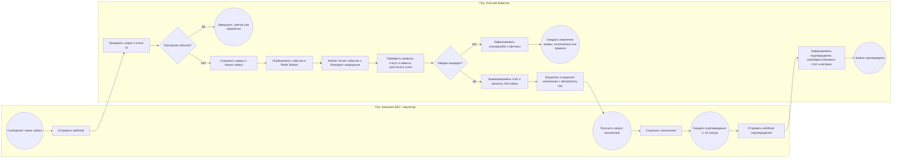

# BPMN процесса назначения заявки

Диаграмма описывает основной успешный маршрут, дубликат webhook, отсутствие кандидата и асинхронное подтверждение АИС. Исходная BPMN 2.0 модель находится в [order-process.bpmn](order-process.bpmn); её можно открыть в BPMN.io или совместимом моделлере. Для быстрого чтения ниже приведён процесс с дорожками.

## Условия перехода

- Неверный webhook secret отклоняется API; повторный `event_id` не создаёт вторую заявку/stream event.
- Если фильтр DSL или дневной лимит исключили всех активных исполнителей, заявка получает состояние `unassignable`; она ставится на повторный подбор при допустимом изменении входных данных или правила.
- Найденного исполнителя блокируют и резервируют в транзакции вместе с outbox записью. Потеря Redis/API после commit не теряет событие.
- Dispatcher повторяет временную ошибку; после лимита попыток запись попадает в DLQ и доступна для ручного повтора.
- АИС фиксирует назначение и подтверждает его отдельным webhook через случайную задержку 2–10 секунд.

