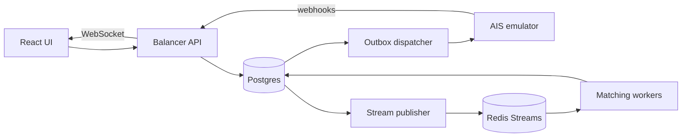

# Component diagram

```mermaid
flowchart LR
  UI[React UI] --> API[Balancer API]
  AIS[AIS emulator] -->|webhooks| API
  API --> DB[(Postgres)]
  DB --> Publisher[Stream publisher]
  Publisher --> Redis[(Redis Streams)]
  Redis --> Workers[Matching workers]
  Workers --> DB
  DB --> Dispatcher[Outbox dispatcher]
  Dispatcher --> AIS
  API -->|WebSocket| UI
```
