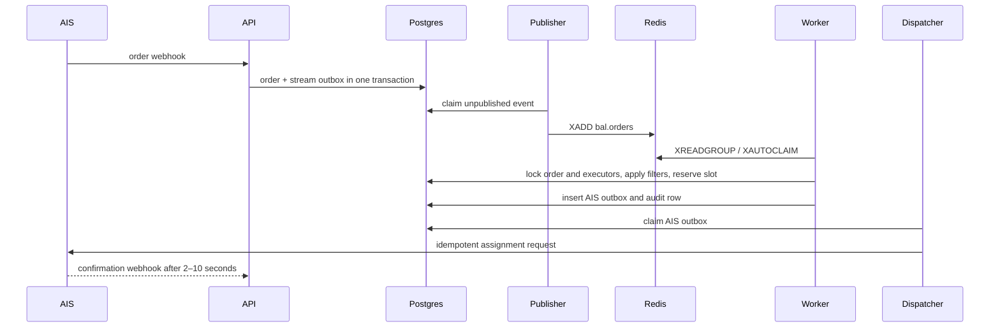

# New order sequence

```mermaid
sequenceDiagram
  participant AIS
  participant API
  participant DB as Postgres
  participant Publisher
  participant Redis
  participant Worker
  participant Dispatcher
  AIS->>API: order webhook
  API->>DB: order + stream outbox in one transaction
  Publisher->>DB: claim unpublished event
  Publisher->>Redis: XADD bal.orders
  Worker->>Redis: XREADGROUP / XAUTOCLAIM
  Worker->>DB: lock order and executors, apply filters, reserve slot
  Worker->>DB: insert AIS outbox and audit row
  Dispatcher->>DB: claim AIS outbox
  Dispatcher->>AIS: idempotent assignment request
  AIS-->>API: confirmation webhook after 2–10 seconds
```
