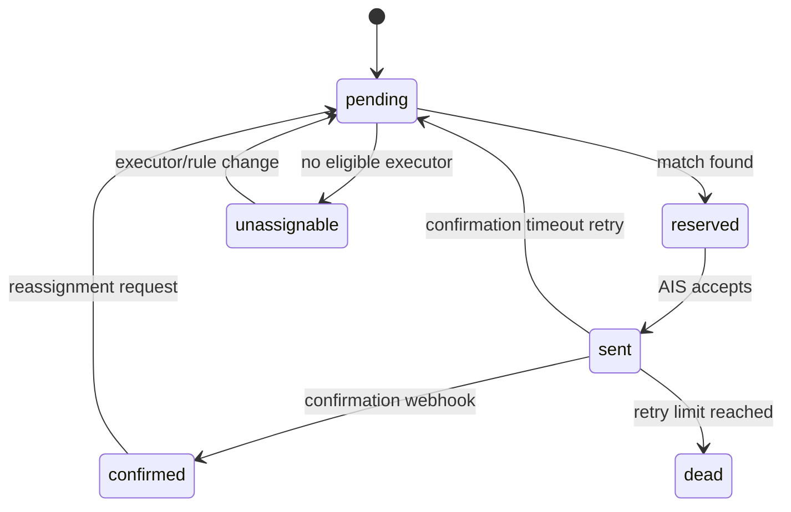

# Order state machine

```mermaid
stateDiagram-v2
  [*] --> pending
  pending --> reserved: match found
  pending --> unassignable: no eligible executor
  unassignable --> pending: executor/rule change
  reserved --> sent: AIS accepts
  sent --> confirmed: confirmation webhook
  sent --> dead: retry limit reached
  sent --> pending: confirmation timeout retry
  confirmed --> pending: reassignment request
```
