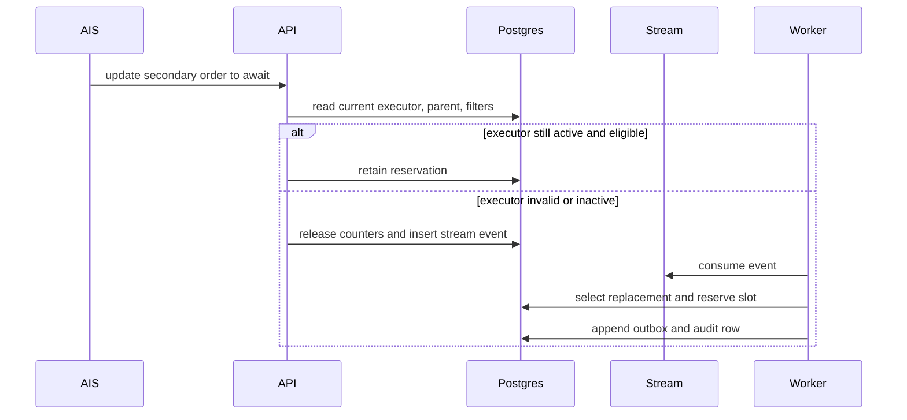

# Secondary order reassignment

```mermaid
sequenceDiagram
  participant AIS
  participant API
  participant DB as Postgres
  participant Stream
  participant Worker
  AIS->>API: update secondary order to await
  API->>DB: read current executor, parent, filters
  alt executor still active and eligible
    API->>DB: retain reservation
  else executor invalid or inactive
    API->>DB: release counters and insert stream event
    Worker->>Stream: consume event
    Worker->>DB: select replacement and reserve slot
    Worker->>DB: append outbox and audit row
  end
```
